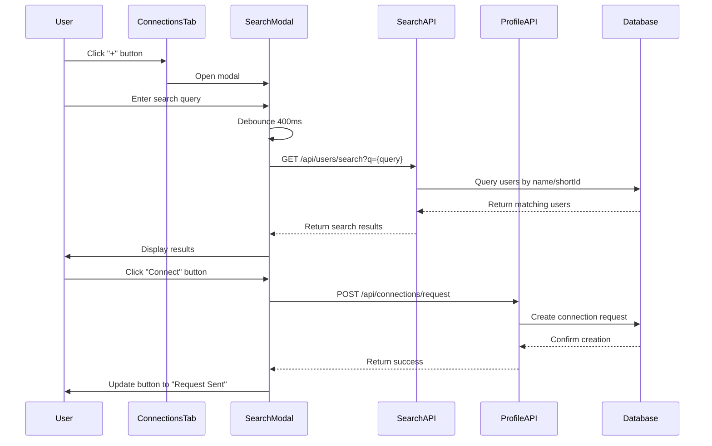

# Design Document: Connection Search and Shareable URLs

## Overview

This feature enhances the Connections functionality by adding a user search system and shareable profile URLs. Users will be able to search for other users by name, shortId, or profile URL through a modal interface accessible from the Connections tab. Additionally, each user will have shareable profile URLs in two formats (`/profile/{shortId}` and `/u/{shortId}`) that can be used to view profiles and initiate connections.

The implementation follows the existing architecture patterns in the application, leveraging React for the frontend, Express.js for the backend, and MongoDB for data persistence. The search system will support multiple query types (name, shortId, URL) with debouncing to optimize performance, while the URL system will add new routes that resolve shortIds to user profiles.

## Architecture

### System Components

The feature consists of four main components:

1. **Connection Search Modal (Frontend)**: A React modal component that provides the search interface
2. **Search API (Backend)**: Express.js endpoints that handle user search queries
3. **Profile URL Routes (Frontend & Backend)**: New routes that resolve shortId-based URLs to user profiles
4. **Connection Request Integration**: Extends existing connection request functionality to work from search results

### Component Interaction Flow



### Data Flow

1. **Search Flow**: User input → Debounce → API request → Database query → Results filtering → UI update
2. **URL Resolution Flow**: URL access → Route matching → shortId extraction → User lookup → Profile display
3. **Connection Request Flow**: Button click → API request → Database update → Notification creation → UI state update

## Components and Interfaces

### Frontend Components

#### ConnectionSearchModal Component

**Location**: `frontend/src/components/ConnectionSearchModal.jsx`

**Props**:
```typescript
interface ConnectionSearchModalProps {
  isOpen: boolean;
  onClose: () => void;
  onConnectionSent?: (userId: string) => void;
}
```

**State**:
```typescript
interface ConnectionSearchModalState {
  searchQuery: string;
  searchResults: SearchResult[];
  loading: boolean;
  error: string | null;
  connectionStates: Map<string, 'idle' | 'pending' | 'sent' | 'connected'>;
}

interface SearchResult {
  _id: string;
  name: string;
  shortId: string;
  avatarUrl?: string;
  location?: string;
  connectionStatus: 'none' | 'pending' | 'connected';
}
```

**Key Methods**:
- `handleSearchChange(query: string)`: Updates search query and triggers debounced search
- `performSearch(query: string)`: Executes API call to search endpoint
- `handleConnect(userId: string)`: Sends connection request
- `extractShortIdFromUrl(query: string)`: Parses URLs to extract shortId

#### Profile Page Updates

**Location**: `frontend/src/pages/Profile.jsx`

**New Features**:
- Display shareable profile URL with copy-to-clipboard functionality
- Add "+" button in Connections tab header when connections exist
- Add "Add My First Connection" button when no connections exist

### Backend API Endpoints

#### User Search Endpoint

**Route**: `GET /api/users/search`

**Query Parameters**:
```typescript
interface SearchQueryParams {
  q: string;        // Search query (name, shortId, or URL)
  limit?: number;   // Max results (default: 10)
}
```

**Response**:
```typescript
interface SearchResponse {
  users: Array<{
    _id: string;
    name: string;
    shortId: string;
    avatarUrl?: string;
    location?: string;
    connectionStatus: 'none' | 'pending' | 'connected';
  }>;
}
```

**Implementation Logic**:
1. Extract shortId from URL if query contains `/profile/` or `/u/`
2. If shortId extracted, search by exact shortId match
3. Otherwise, search by partial name match (case-insensitive)
4. Exclude current user from results
5. Limit results to 10 users
6. For each user, determine connection status with requester
7. Return formatted results

#### Profile URL Routes

**Frontend Routes**:
- `/profile/:shortId` - Primary shareable URL format
- `/u/:shortId` - Alternative short URL format

**Backend Route** (if needed for direct access):
- `GET /api/users/by-shortid/:shortId` - Resolve shortId to user profile

Both frontend routes will resolve to the existing Profile component, which already accepts user IDs. The routes will need to resolve the shortId to the user's actual ID before rendering.

### Database Schema

No new models are required. The feature uses existing models:

**User Model** (already exists):
```javascript
{
  _id: String,
  shortId: String,      // Used for shareable URLs
  name: String,
  email: String,
  avatarUrl: String,
  location: String,
  // ... other fields
}
```

**Connection Model** (already exists):
```javascript
{
  _id: String,
  requesterId: String,
  addresseeId: String,
  status: String,       // 'pending' | 'accepted' | 'declined'
  createdAt: Date,
  updatedAt: Date
}
```

### Service Layer

#### User Search Service

**Location**: `backend/src/services/userSearch.js` (new file)

**Key Functions**:

```javascript
async function searchUsers(query, requesterId, limit = 10) {
  // 1. Parse query to detect URL patterns
  const shortId = extractShortIdFromQuery(query);
  
  // 2. Build search criteria
  let searchCriteria;
  if (shortId) {
    searchCriteria = { shortId: shortId };
  } else {
    searchCriteria = {
      name: { $regex: query, $options: 'i' },
      _id: { $ne: requesterId }
    };
  }
  
  // 3. Execute search
  const users = await User.find(searchCriteria)
    .select('_id name shortId avatarUrl location')
    .limit(limit)
    .lean();
  
  // 4. Determine connection status for each user
  const userIds = users.map(u => u._id);
  const connections = await Connection.find({
    $or: [
      { requesterId: requesterId, addresseeId: { $in: userIds } },
      { requesterId: { $in: userIds }, addresseeId: requesterId }
    ]
  }).lean();
  
  // 5. Map connection status to users
  const results = users.map(user => {
    const conn = connections.find(c => 
      (c.requesterId === requesterId && c.addresseeId === user._id) ||
      (c.addresseeId === requesterId && c.requesterId === user._id)
    );
    
    return {
      ...user,
      connectionStatus: conn 
        ? (conn.status === 'accepted' ? 'connected' : 'pending')
        : 'none'
    };
  });
  
  return results;
}

function extractShortIdFromQuery(query) {
  // Match patterns: /profile/abc123, /u/abc123, https://domain.com/profile/abc123
  const patterns = [
    /\/profile\/([a-zA-Z0-9_-]+)/,
    /\/u\/([a-zA-Z0-9_-]+)/
  ];
  
  for (const pattern of patterns) {
    const match = query.match(pattern);
    if (match) return match[1];
  }
  
  return null;
}
```

## Data Models

No new data models are required. The feature leverages existing User and Connection models.

### User Model Extensions

The User model already contains the `shortId` field required for shareable URLs. No schema changes needed.

### Connection Status Determination

Connection status is computed dynamically by querying the Connection model:
- `none`: No connection record exists between users
- `pending`: Connection record exists with status 'pending'
- `connected`: Connection record exists with status 'accepted'


## Correctness Properties

*A property is a characteristic or behavior that should hold true across all valid executions of a system—essentially, a formal statement about what the system should do. Properties serve as the bridge between human-readable specifications and machine-verifiable correctness guarantees.*

### Property 1: Search Query Execution

*For any* valid search query entered by a user, the search system should execute a search and return matching users based on the query type (name, shortId, or URL).

**Validates: Requirements 2.3**

### Property 2: Exact ShortId Match

*For any* valid shortId provided as a search query, the search system should return the user with that exact shortId (if they exist and are not the current user).

**Validates: Requirements 2.4**

### Property 3: Partial Name Match

*For any* partial name string provided as a search query, the search system should return all users whose names contain that string (case-insensitive), excluding the current user.

**Validates: Requirements 2.5**

### Property 4: URL-Based Search

*For any* valid profile URL (in format `/profile/{shortId}`, `/u/{shortId}`, or full URL), the search system should extract the shortId and return the corresponding user.

**Validates: Requirements 2.6, 7.1, 7.2, 7.4, 7.5**

### Property 5: Search Result User Information Completeness

*For any* user in search results, the displayed information should include the user's avatar, name, shortId, and location (if available).

**Validates: Requirements 3.2, 3.3, 3.4, 3.5**

### Property 6: Search Result Limit

*For any* search query, the number of results returned should never exceed 10 users.

**Validates: Requirements 3.7**

### Property 7: Current User Exclusion

*For any* search query, the current user should never appear in the search results.

**Validates: Requirements 3.8**

### Property 8: Connect Button Presence

*For any* user displayed in search results, a "Connect" button (or appropriate connection status indicator) should be present.

**Validates: Requirements 4.1**

### Property 9: Connection Request Creation

*For any* user in search results, clicking the "Connect" button should send a connection request to that user.

**Validates: Requirements 4.2**

### Property 10: Connection Request UI State Update

*For any* user in search results, after successfully sending a connection request, the button should change to "Request Sent" state and become disabled.

**Validates: Requirements 4.3, 4.4**

### Property 11: Existing Connection Status Display

*For any* user in search results who already has a connection with the current user (either accepted or pending), the UI should display the appropriate status ("Connected" or "Request Sent") instead of a "Connect" button.

**Validates: Requirements 4.5, 4.6**

### Property 12: Connection Request Error Handling

*For any* failed connection request, the system should display an error message to the user.

**Validates: Requirements 4.7**

### Property 13: Profile URL Format Interchangeability

*For any* user with a valid shortId, both URL formats (`/profile/{shortId}` and `/u/{shortId}`) should resolve to the same user profile.

**Validates: Requirements 5.1, 5.2, 5.5**

### Property 14: Profile URL Resolution

*For any* valid shortId in a profile URL, the system should resolve it to the corresponding user's profile page.

**Validates: Requirements 5.3**

### Property 15: Invalid ShortId Error Handling

*For any* invalid shortId in a profile URL, the system should display a "User not found" message.

**Validates: Requirements 5.4**

### Property 16: Invalid URL Fallback

*For any* search query that contains URL-like patterns but cannot be parsed as a valid profile URL, the system should treat it as a regular name search.

**Validates: Requirements 7.3**

### Property 17: Connection Request Notification Creation

*For any* connection request sent, the system should create a notification for the recipient that includes the sender's name, avatar, and action buttons to accept or decline.

**Validates: Requirements 9.1, 9.2, 9.3**

### Property 18: Connection Response Notification

*For any* connection request that is accepted or declined, the system should create a notification for the original requester.

**Validates: Requirements 9.4, 9.5**

## Error Handling

### Search Errors

1. **Empty Query**: Queries with less than 2 characters return empty results without making API calls
2. **Network Errors**: Display user-friendly error message "Unable to search. Please check your connection."
3. **API Errors**: Display error message from server or generic "Search failed. Please try again."
4. **No Results**: Display "No users found" message when search returns empty results

### Connection Request Errors

1. **Duplicate Request**: If a connection request already exists, display "Request already pending"
2. **Self-Connection**: Prevent users from connecting with themselves (handled by backend)
3. **Network Errors**: Display "Unable to send request. Please try again."
4. **Invalid User**: Display "User not found" if target user doesn't exist

### URL Resolution Errors

1. **Invalid ShortId**: Display "User not found" page when shortId doesn't match any user
2. **Malformed URL**: Redirect to 404 page or home page for completely invalid URLs
3. **Missing ShortId**: Handle edge case where shortId parameter is empty

### State Management Errors

1. **Stale Connection Status**: Refresh connection status when modal reopens
2. **Race Conditions**: Prevent multiple simultaneous connection requests to the same user
3. **Modal State**: Ensure modal state resets when closed and reopened

## Testing Strategy

### Unit Testing

Unit tests will focus on specific examples, edge cases, and integration points:

**Frontend Unit Tests** (`ConnectionSearchModal.test.jsx`):
- Modal opens when "+" button is clicked (Requirement 1.4)
- Search input displays correct placeholder text (Requirement 2.2)
- Loading indicator appears during search (Requirement 2.8)
- "No users found" message displays for empty results (Requirement 3.6)
- Debounce waits 400ms before executing search (Requirement 8.1)
- Debounce resets timer when new character is typed (Requirement 8.2)
- Only one search request per typing session (Requirement 8.3)
- Modal is full-screen on mobile devices (Requirement 10.1)
- Close button is visible on mobile (Requirement 10.2)
- Results are scrollable on mobile (Requirement 10.3)
- Connect buttons meet minimum touch target size (Requirement 10.4)

**Frontend Unit Tests** (`Profile.test.jsx`):
- "Add My First Connection" button displays when no connections (Requirement 1.1)
- "+" button displays in header when connections exist (Requirement 1.2)
- Shareable URL displays on own profile (Requirement 6.1)
- URL is in copyable format (Requirement 6.2)
- Clicking URL copies to clipboard (Requirement 6.3)
- "Copied!" confirmation displays after copy (Requirement 6.4)

**Backend Unit Tests** (`userSearch.test.js`):
- URL extraction handles full URLs correctly
- URL extraction handles partial URLs correctly
- Search excludes current user
- Search limits results to 10 users
- Invalid shortId returns empty results
- Empty query returns empty results

**Integration Tests**:
- End-to-end search flow from modal open to results display
- Connection request flow from search to notification
- URL resolution from shareable link to profile page

### Property-Based Testing

Property tests will verify universal properties across all inputs. Each test will run a minimum of 100 iterations with randomized inputs.

**Property Test Configuration**: Using `fast-check` library for JavaScript property-based testing.

**Frontend Property Tests** (`ConnectionSearchModal.property.test.jsx`):

```javascript
// Feature: connection-search-and-shareable-urls, Property 1: Search Query Execution
test('any valid search query executes search and returns results', async () => {
  await fc.assert(
    fc.asyncProperty(fc.string({ minLength: 2, maxLength: 50 }), async (query) => {
      // Test that search executes for any valid query
    }),
    { numRuns: 100 }
  );
});

// Feature: connection-search-and-shareable-urls, Property 5: Search Result User Information Completeness
test('all search results display complete user information', async () => {
  await fc.assert(
    fc.asyncProperty(fc.array(fc.record({
      _id: fc.string(),
      name: fc.string(),
      shortId: fc.string(),
      avatarUrl: fc.option(fc.string()),
      location: fc.option(fc.string())
    })), (users) => {
      // Test that all required fields are rendered for each user
    }),
    { numRuns: 100 }
  );
});

// Feature: connection-search-and-shareable-urls, Property 6: Search Result Limit
test('search results never exceed 10 users', async () => {
  await fc.assert(
    fc.asyncProperty(fc.string({ minLength: 2 }), async (query) => {
      const results = await searchUsers(query);
      return results.length <= 10;
    }),
    { numRuns: 100 }
  );
});

// Feature: connection-search-and-shareable-urls, Property 7: Current User Exclusion
test('current user never appears in search results', async () => {
  await fc.assert(
    fc.asyncProperty(fc.string({ minLength: 2 }), fc.string(), async (query, currentUserId) => {
      const results = await searchUsers(query, currentUserId);
      return !results.some(user => user._id === currentUserId);
    }),
    { numRuns: 100 }
  );
});
```

**Backend Property Tests** (`userSearch.property.test.js`):

```javascript
// Feature: connection-search-and-shareable-urls, Property 2: Exact ShortId Match
test('any valid shortId returns the correct user', async () => {
  await fc.assert(
    fc.asyncProperty(fc.string({ minLength: 5, maxLength: 20 }), async (shortId) => {
      // Create user with shortId, search for it, verify correct user returned
    }),
    { numRuns: 100 }
  );
});

// Feature: connection-search-and-shareable-urls, Property 3: Partial Name Match
test('any partial name string returns users containing that string', async () => {
  await fc.assert(
    fc.asyncProperty(fc.string({ minLength: 2 }), async (nameFragment) => {
      const results = await searchUsers(nameFragment, 'testUserId');
      return results.every(user => 
        user.name.toLowerCase().includes(nameFragment.toLowerCase())
      );
    }),
    { numRuns: 100 }
  );
});

// Feature: connection-search-and-shareable-urls, Property 4: URL-Based Search
test('any valid profile URL extracts shortId and returns user', async () => {
  await fc.assert(
    fc.asyncProperty(
      fc.string({ minLength: 5, maxLength: 20 }),
      fc.constantFrom('/profile/', '/u/', 'https://example.com/profile/', 'https://example.com/u/'),
      async (shortId, urlPrefix) => {
        const url = urlPrefix + shortId;
        const extracted = extractShortIdFromQuery(url);
        return extracted === shortId;
      }
    ),
    { numRuns: 100 }
  );
});

// Feature: connection-search-and-shareable-urls, Property 13: Profile URL Format Interchangeability
test('both URL formats resolve to same user profile', async () => {
  await fc.assert(
    fc.asyncProperty(fc.string({ minLength: 5, maxLength: 20 }), async (shortId) => {
      const user1 = await resolveProfileUrl(`/profile/${shortId}`);
      const user2 = await resolveProfileUrl(`/u/${shortId}`);
      return user1?._id === user2?._id;
    }),
    { numRuns: 100 }
  );
});

// Feature: connection-search-and-shareable-urls, Property 14: Profile URL Resolution
test('any valid shortId URL resolves to correct user profile', async () => {
  await fc.assert(
    fc.asyncProperty(fc.string({ minLength: 5, maxLength: 20 }), async (shortId) => {
      // Create user with shortId, resolve URL, verify correct user
    }),
    { numRuns: 100 }
  );
});

// Feature: connection-search-and-shareable-urls, Property 16: Invalid URL Fallback
test('invalid URL patterns fall back to name search', async () => {
  await fc.assert(
    fc.asyncProperty(fc.string({ minLength: 2 }), async (invalidUrl) => {
      // Test that malformed URLs are treated as name searches
    }),
    { numRuns: 100 }
  );
});

// Feature: connection-search-and-shareable-urls, Property 17: Connection Request Notification Creation
test('any connection request creates notification with complete information', async () => {
  await fc.assert(
    fc.asyncProperty(
      fc.string(),
      fc.string(),
      async (requesterId, addresseeId) => {
        await sendConnectionRequest(requesterId, addresseeId);
        const notification = await getLatestNotification(addresseeId);
        return notification &&
               notification.senderId === requesterId &&
               notification.type === 'connection_request' &&
               notification.message.includes('connection request');
      }
    ),
    { numRuns: 100 }
  );
});
```

### Test Coverage Goals

- Unit test coverage: 80% minimum
- Property test coverage: All 18 correctness properties
- Integration test coverage: All critical user flows
- Edge case coverage: All error conditions and boundary cases

### Testing Tools

- **Unit Testing**: Jest + React Testing Library
- **Property-Based Testing**: fast-check
- **Integration Testing**: Cypress or Playwright
- **API Testing**: Supertest
- **Mocking**: MSW (Mock Service Worker) for API mocking

