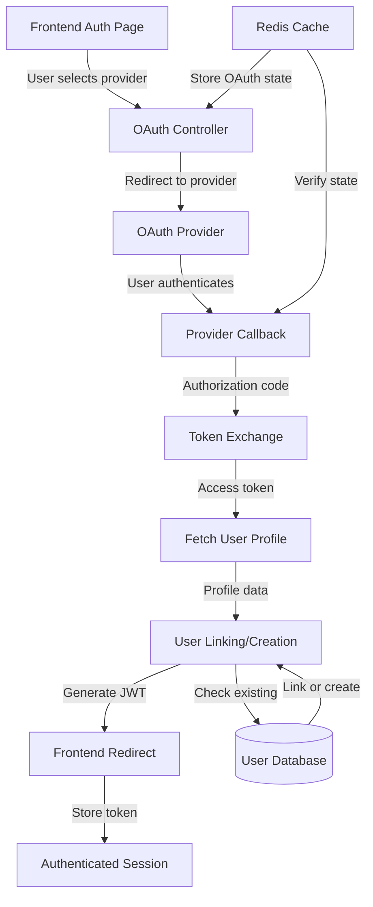
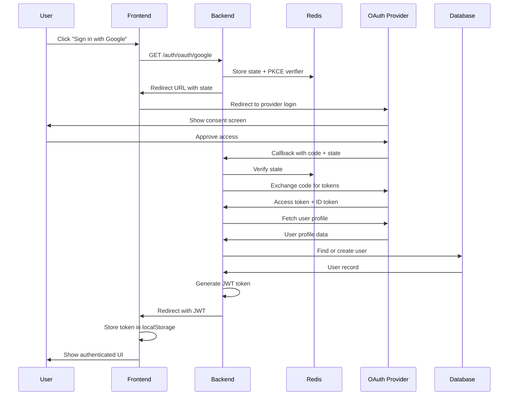

# Design Document: OAuth/SSO Integration

## Overview

This design adds OAuth 2.0 and Single Sign-On (SSO) capabilities to the existing authentication system. Users can authenticate using third-party providers (Google, GitHub, Microsoft, etc.) by selecting a provider from a predefined list, without manually entering URLs. The system handles OAuth flow, token exchange, user account linking/creation, and seamless integration with the existing JWT-based authentication.

The implementation extends the current email/password + OTP authentication system while maintaining backward compatibility. OAuth accounts are linked to existing User records, with provider-specific identifiers stored for future logins.

## Architecture



## Main OAuth Flow



## Components and Interfaces

### Component 1: OAuth Provider Registry

**Purpose**: Centralized configuration for all supported OAuth providers

**Interface**:
```typescript
interface OAuthProvider {
  name: string;
  displayName: string;
  authUrl: string;
  tokenUrl: string;
  userInfoUrl: string;
  scope: string[];
  clientId: string;
  clientSecret: string;
  callbackPath: string;
  icon?: string;
}

interface OAuthProviderRegistry {
  getProvider(name: string): OAuthProvider | null;
  getAllProviders(): OAuthProvider[];
  isProviderEnabled(name: string): boolean;
}
```

**Responsibilities**:
- Store OAuth provider configurations (URLs, scopes, credentials)
- Validate provider names against supported list
- Return provider-specific configuration for auth flow
- Support dynamic provider enabling/disabling via environment variables

### Component 2: OAuth Controller

**Purpose**: Handle OAuth initiation and callback endpoints

**Interface**:
```typescript
interface OAuthController {
  initiateOAuth(req: Request, res: Response): Promise<void>;
  handleCallback(req: Request, res: Response): Promise<void>;
  linkAccount(req: Request, res: Response): Promise<void>;
  unlinkAccount(req: Request, res: Response): Promise<void>;
}

interface OAuthInitiateRequest {
  provider: string; // 'google', 'github', 'microsoft', etc.
}

interface OAuthCallbackQuery {
  code: string;
  state: string;
  error?: string;
}
```

**Responsibilities**:
- Generate authorization URLs with state and PKCE parameters
- Validate callback state to prevent CSRF attacks
- Exchange authorization code for access tokens
- Fetch user profile from provider
- Link OAuth account to existing user or create new user
- Generate JWT token for authenticated session

### Component 3: OAuth Service

**Purpose**: Business logic for OAuth operations

**Interface**:
```typescript
interface OAuthService {
  generateAuthUrl(provider: string, state: string, codeVerifier: string): string;
  exchangeCodeForToken(provider: string, code: string, codeVerifier: string): Promise<OAuthTokenResponse>;
  fetchUserProfile(provider: string, accessToken: string): Promise<OAuthUserProfile>;
  findOrCreateUser(profile: OAuthUserProfile, provider: string): Promise<User>;
  linkOAuthAccount(userId: string, provider: string, providerId: string): Promise<void>;
  unlinkOAuthAccount(userId: string, provider: string): Promise<void>;
}

interface OAuthTokenResponse {
  access_token: string;
  token_type: string;
  expires_in: number;
  refresh_token?: string;
  id_token?: string;
}

interface OAuthUserProfile {
  providerId: string;
  email: string;
  name: string;
  avatarUrl?: string;
  emailVerified: boolean;
}
```

**Responsibilities**:
- Build OAuth authorization URLs with proper parameters
- Handle token exchange with provider APIs
- Parse and normalize user profiles from different providers
- Create new users or link to existing accounts based on email
- Manage OAuth account linking/unlinking

### Component 4: State Management (Redis)

**Purpose**: Securely store and verify OAuth state parameters

**Interface**:
```typescript
interface OAuthStateManager {
  createState(userId?: string): Promise<OAuthState>;
  verifyState(stateToken: string): Promise<OAuthState | null>;
  deleteState(stateToken: string): Promise<void>;
}

interface OAuthState {
  token: string;
  codeVerifier: string;
  userId?: string; // For account linking
  createdAt: Date;
  expiresAt: Date;
}
```

**Responsibilities**:
- Generate cryptographically secure state tokens
- Store state with PKCE code verifier in Redis
- Verify state on callback to prevent CSRF
- Automatically expire state after 10 minutes
- Support both new user signup and account linking flows

## Data Models

### Model 1: User (Extended)

```typescript
interface User {
  _id: string;
  shortId: string;
  name: string;
  email?: string;
  phone?: string;
  password?: string;
  bio?: string;
  avatarUrl?: string;
  location?: string;
  
  // OAuth provider IDs
  googleId?: string;
  githubId?: string;
  microsoftId?: string;
  facebookId?: string;
  appleId?: string;
  
  // Existing fields
  stravaId?: string;
  garminId?: string;
  instagramId?: string;
  portfolioUrl?: string;
  allowTagging: string;
  theme: string;
  accountType: string;
  lookingFor: string;
  onboardingComplete: boolean;
  isEmailVerified: boolean;
  passwordResetToken?: string;
  passwordResetExpires?: Date;
  createdAt: Date;
}
```

**Validation Rules**:
- At least one authentication method required (email+password, phone, or OAuth provider)
- Email must be unique if provided
- OAuth provider IDs must be unique per provider
- Email is automatically verified when created via OAuth

### Model 2: OAuthState (Redis)

```typescript
interface OAuthState {
  token: string; // Random UUID
  codeVerifier: string; // PKCE code verifier
  provider: string; // 'google', 'github', etc.
  userId?: string; // For account linking flow
  createdAt: number; // Unix timestamp
  expiresAt: number; // Unix timestamp (10 minutes)
}
```

**Validation Rules**:
- State token must be cryptographically random (UUID v4)
- Code verifier must be 43-128 characters (PKCE spec)
- Expires after 10 minutes
- Deleted after successful verification

## Key Functions with Formal Specifications

### Function 1: initiateOAuth()

```typescript
async function initiateOAuth(req: Request, res: Response): Promise<void>
```

**Preconditions:**
- `req.params.provider` is a valid, enabled OAuth provider name
- Provider configuration exists in environment variables
- Redis connection is available

**Postconditions:**
- OAuth state is stored in Redis with 10-minute expiration
- User is redirected to provider's authorization URL
- Authorization URL includes state, code_challenge, and required scopes
- If provider is invalid, returns 400 error

**Loop Invariants:** N/A

### Function 2: handleCallback()

```typescript
async function handleCallback(req: Request, res: Response): Promise<void>
```

**Preconditions:**
- `req.query.code` contains authorization code from provider
- `req.query.state` matches a valid state token in Redis
- Provider configuration exists

**Postconditions:**
- State token is verified and deleted from Redis
- Authorization code is exchanged for access token
- User profile is fetched from provider
- User account is created or linked based on email
- JWT token is generated and returned
- User is redirected to frontend with token
- If state is invalid or expired, returns 401 error
- If token exchange fails, returns 502 error

**Loop Invariants:** N/A

### Function 3: findOrCreateUser()

```typescript
async function findOrCreateUser(
  profile: OAuthUserProfile, 
  provider: string
): Promise<User>
```

**Preconditions:**
- `profile.email` is a valid email address
- `profile.providerId` is non-empty string
- `provider` is a valid provider name

**Postconditions:**
- If user with matching email exists: provider ID is added to user record
- If user with matching provider ID exists: returns existing user
- If no match: new user is created with email verified
- Returns valid User object with provider ID set
- User.isEmailVerified is true for OAuth users
- No duplicate provider IDs exist in database

**Loop Invariants:** N/A

### Function 4: generateAuthUrl()

```typescript
function generateAuthUrl(
  provider: string, 
  state: string, 
  codeVerifier: string
): string
```

**Preconditions:**
- `provider` is a valid, enabled OAuth provider
- `state` is a non-empty UUID string
- `codeVerifier` is a valid PKCE verifier (43-128 chars)

**Postconditions:**
- Returns valid OAuth authorization URL
- URL includes client_id, redirect_uri, scope, state, code_challenge
- code_challenge is SHA256 hash of codeVerifier (base64url encoded)
- response_type is set to 'code'
- All parameters are properly URL-encoded

**Loop Invariants:** N/A

## Algorithmic Pseudocode

### Main OAuth Initiation Algorithm

```pascal
ALGORITHM initiateOAuth(request)
INPUT: request containing provider name
OUTPUT: redirect to OAuth provider

BEGIN
  ASSERT request.params.provider IS NOT NULL
  
  // Step 1: Validate provider
  provider ← getProvider(request.params.provider)
  IF provider IS NULL THEN
    RETURN error(400, "Invalid or unsupported provider")
  END IF
  
  // Step 2: Generate security parameters
  state ← generateUUID()
  codeVerifier ← generateRandomString(128)
  codeChallenge ← base64url(sha256(codeVerifier))
  
  // Step 3: Store state in Redis
  oauthState ← {
    token: state,
    codeVerifier: codeVerifier,
    provider: request.params.provider,
    userId: request.user?.userId OR NULL,
    createdAt: now(),
    expiresAt: now() + 600 // 10 minutes
  }
  
  AWAIT redis.set("oauth:state:" + state, JSON.stringify(oauthState), EX: 600)
  
  // Step 4: Build authorization URL
  authUrl ← provider.authUrl + "?" + queryString({
    client_id: provider.clientId,
    redirect_uri: BASE_URL + provider.callbackPath,
    response_type: "code",
    scope: provider.scope.join(" "),
    state: state,
    code_challenge: codeChallenge,
    code_challenge_method: "S256"
  })
  
  // Step 5: Redirect user
  RETURN redirect(authUrl)
END
```

**Preconditions:**
- Provider name is provided in request
- Redis is connected and operational
- Environment variables contain provider credentials

**Postconditions:**
- State is stored in Redis with 10-minute TTL
- User is redirected to provider authorization page
- All security parameters (state, PKCE) are properly generated

**Loop Invariants:** N/A

### OAuth Callback Processing Algorithm

```pascal
ALGORITHM handleCallback(request)
INPUT: request containing code and state from OAuth provider
OUTPUT: JWT token and user data

BEGIN
  ASSERT request.query.code IS NOT NULL
  ASSERT request.query.state IS NOT NULL
  
  // Step 1: Verify state (CSRF protection)
  stateKey ← "oauth:state:" + request.query.state
  stateData ← AWAIT redis.get(stateKey)
  
  IF stateData IS NULL THEN
    RETURN error(401, "Invalid or expired state")
  END IF
  
  oauthState ← JSON.parse(stateData)
  AWAIT redis.del(stateKey) // One-time use
  
  IF now() > oauthState.expiresAt THEN
    RETURN error(401, "State expired")
  END IF
  
  // Step 2: Get provider configuration
  provider ← getProvider(oauthState.provider)
  
  // Step 3: Exchange authorization code for tokens
  tokenResponse ← AWAIT httpPost(provider.tokenUrl, {
    grant_type: "authorization_code",
    code: request.query.code,
    redirect_uri: BASE_URL + provider.callbackPath,
    client_id: provider.clientId,
    client_secret: provider.clientSecret,
    code_verifier: oauthState.codeVerifier
  })
  
  IF tokenResponse.error THEN
    RETURN error(502, "Token exchange failed")
  END IF
  
  // Step 4: Fetch user profile
  profileResponse ← AWAIT httpGet(provider.userInfoUrl, {
    headers: { Authorization: "Bearer " + tokenResponse.access_token }
  })
  
  profile ← normalizeProfile(profileResponse, oauthState.provider)
  
  // Step 5: Find or create user
  user ← AWAIT findOrCreateUser(profile, oauthState.provider)
  
  // Step 6: Generate JWT
  jwtToken ← jwt.sign({ userId: user._id }, JWT_SECRET, { expiresIn: "30d" })
  
  // Step 7: Redirect to frontend with token
  frontendUrl ← FRONTEND_URL + "/auth/callback?token=" + jwtToken
  RETURN redirect(frontendUrl)
END
```

**Preconditions:**
- Authorization code and state are present in query parameters
- State exists in Redis and has not expired
- Provider configuration is valid
- Database connection is available

**Postconditions:**
- State is deleted from Redis (one-time use)
- Access token is obtained from provider
- User profile is fetched and normalized
- User account is created or linked
- Valid JWT token is generated
- User is redirected to frontend with token

**Loop Invariants:** N/A

### User Linking Algorithm

```pascal
ALGORITHM findOrCreateUser(profile, providerName)
INPUT: profile (OAuthUserProfile), providerName (string)
OUTPUT: User object

BEGIN
  ASSERT profile.email IS NOT NULL
  ASSERT profile.providerId IS NOT NULL
  
  providerField ← providerName + "Id" // e.g., "googleId"
  
  // Step 1: Check if user exists with this provider ID
  query1 ← { [providerField]: profile.providerId }
  existingUser ← AWAIT User.findOne(query1)
  
  IF existingUser IS NOT NULL THEN
    RETURN existingUser
  END IF
  
  // Step 2: Check if user exists with this email
  query2 ← { email: profile.email }
  userByEmail ← AWAIT User.findOne(query2)
  
  IF userByEmail IS NOT NULL THEN
    // Link OAuth account to existing user
    updateData ← { [providerField]: profile.providerId }
    
    IF userByEmail.avatarUrl IS NULL AND profile.avatarUrl IS NOT NULL THEN
      updateData.avatarUrl ← profile.avatarUrl
    END IF
    
    updateData.isEmailVerified ← true
    
    AWAIT User.findByIdAndUpdate(userByEmail._id, updateData)
    
    updatedUser ← AWAIT User.findById(userByEmail._id)
    RETURN updatedUser
  END IF
  
  // Step 3: Create new user
  userId ← generateUUID()
  shortId ← AWAIT generateShortId()
  
  newUser ← {
    _id: userId,
    shortId: shortId,
    name: profile.name,
    email: profile.email,
    avatarUrl: profile.avatarUrl OR NULL,
    [providerField]: profile.providerId,
    isEmailVerified: true,
    onboardingComplete: false,
    createdAt: now()
  }
  
  user ← AWAIT User.create(newUser)
  RETURN user
END
```

**Preconditions:**
- Profile contains valid email and provider ID
- Provider name is valid
- Database connection is available

**Postconditions:**
- If user with provider ID exists: returns existing user
- If user with email exists: links provider ID to that user
- If no match: creates new user with provider ID
- Email is marked as verified for OAuth users
- Returns valid User object

**Loop Invariants:** N/A

## Example Usage

```typescript
// Example 1: User initiates Google OAuth
// Frontend: User clicks "Sign in with Google"
const response = await fetch('/api/auth/oauth/google');
// Backend redirects to Google's authorization page

// Example 2: Google redirects back with authorization code
// URL: /api/auth/oauth/google/callback?code=abc123&state=xyz789
// Backend processes callback:
const state = await redis.get('oauth:state:xyz789');
const tokens = await exchangeCodeForToken('google', 'abc123', state.codeVerifier);
const profile = await fetchUserProfile('google', tokens.access_token);
const user = await findOrCreateUser(profile, 'google');
const jwt = generateJWT(user._id);
// Redirect to: https://frontend.com/auth/callback?token=jwt_token_here

// Example 3: Link GitHub to existing account (authenticated user)
// User is already logged in with email/password
const response = await fetch('/api/auth/oauth/github', {
  headers: { Authorization: 'Bearer existing_jwt_token' }
});
// Backend stores userId in state, processes OAuth flow
// After callback, GitHub account is linked to existing user

// Example 4: Frontend receives token and stores it
// URL: /auth/callback?token=jwt_token_here
const urlParams = new URLSearchParams(window.location.search);
const token = urlParams.get('token');
localStorage.setItem('token', token);
navigate('/');
```

## Correctness Properties

*A property is a characteristic or behavior that should hold true across all valid executions of a system—essentially, a formal statement about what the system should do. Properties serve as the bridge between human-readable specifications and machine-verifiable correctness guarantees.*

### Property 1: Provider Configuration Loading

*For any* set of environment variables containing OAuth provider credentials, the Provider_Registry should correctly load and enable providers with complete credentials, and disable providers with missing credentials.

**Validates: Requirements 1.1, 1.2, 1.3, 1.4, 1.5**

### Property 2: State Token Generation and Storage

*For any* OAuth initiation request, the State_Manager should generate a unique UUID v4 state token, store it in Redis with a 600-second TTL, and include all required fields (token, codeVerifier, provider, optional userId).

**Validates: Requirements 2.1, 2.4, 3.1, 3.2, 3.3**

### Property 3: PKCE Code Challenge Computation

*For any* code verifier of 128 characters, the OAuth_System should compute the code challenge as base64url(SHA256(codeVerifier)), and this computation should be reversible for verification.

**Validates: Requirements 2.2, 2.3, 15.1, 15.2**

### Property 4: Authorization URL Structure

*For any* valid enabled provider and generated state, the authorization URL should include all required parameters: client_id, redirect_uri, response_type, scope, state, code_challenge, and code_challenge_method=S256.

**Validates: Requirements 2.5, 2.6, 15.3**

### Property 5: Invalid Provider Rejection

*For any* invalid or disabled provider name, the Auth_Controller should return a 400 error with message "Invalid or unsupported provider".

**Validates: Requirements 2.7, 10.1**

### Property 6: State Verification and One-Time Use

*For any* OAuth callback with a valid state token, the Auth_Controller should verify the state matches a stored token in Redis, then delete that token, ensuring it cannot be reused.

**Validates: Requirements 3.4, 3.6, 3.7**

### Property 7: Invalid State Rejection

*For any* OAuth callback with an invalid or expired state token, the Auth_Controller should return a 401 error with message "Invalid or expired state".

**Validates: Requirements 3.5, 10.2**

### Property 8: Token Exchange Request Structure

*For any* valid authorization code and state, the token exchange request should include all required parameters: grant_type, code, redirect_uri, client_id, client_secret, and code_verifier.

**Validates: Requirements 4.3, 15.4**

### Property 9: User Profile Authorization Header

*For any* user profile fetch request, the Authorization header should be formatted as "Bearer " + access_token.

**Validates: Requirements 4.5**

### Property 10: User Lookup by Provider ID

*For any* OAuth user profile with a provider ID, if a User_Record with matching provider ID exists, the OAuth_Service should return that existing user without creating a new one.

**Validates: Requirements 5.1, 5.2**

### Property 11: User Lookup by Email Fallback

*For any* OAuth user profile where no User_Record matches the provider ID, if a User_Record with matching email exists, the OAuth_Service should link the provider ID to that user.

**Validates: Requirements 5.3, 5.4**

### Property 12: OAuth Account Linking Updates

*For any* existing user being linked to an OAuth account, the OAuth_Service should set isEmailVerified to true, and if the user has no avatar and the profile includes one, update the avatarUrl.

**Validates: Requirements 5.5, 5.6**

### Property 13: New User Creation via OAuth

*For any* OAuth profile with no matching User_Record by provider ID or email, the OAuth_Service should create a new user with isEmailVerified=true and onboardingComplete=false.

**Validates: Requirements 5.7, 5.8, 5.9**

### Property 14: Provider ID Uniqueness

*For any* provider and provider ID, no two different users should have the same provider ID for that provider.

**Validates: Requirements 5.10, 8.3**

### Property 15: JWT Token Generation

*For any* successfully authenticated OAuth user, the Auth_Controller should generate a JWT token containing the user ID, signed with the secret key, with 30-day expiration.

**Validates: Requirements 6.1, 6.2, 6.3**

### Property 16: Frontend Redirect URL Structure

*For any* generated JWT token, the frontend redirect URL should be formatted as FRONTEND_URL + "/auth/callback?token=" + JWT_Token.

**Validates: Requirements 6.4, 6.5**

### Property 17: GitHub Skill Verification

*For any* GitHub OAuth authentication where the user has more than 5 public repositories, the OAuth_System should create or update a Skill_Verification record with verificationType="github", status="verified", and a verifiedAt timestamp.

**Validates: Requirements 7.3, 7.4, 7.5**

### Property 18: GitHub Username Storage

*For any* successful GitHub OAuth authentication, the OAuth_System should store the GitHub username in the User_Record.

**Validates: Requirements 7.6**

### Property 19: Multiple OAuth Providers Support

*For any* user account, the OAuth_System should allow multiple OAuth provider IDs to be set on the same user.

**Validates: Requirements 8.4, 11.4**

### Property 20: Authentication Method Requirement

*For any* User_Record, at least one authentication method must be present (email+password, phone, or OAuth provider ID).

**Validates: Requirements 8.5**

### Property 21: OAuth Token Non-Persistence

*For any* completed OAuth flow, the OAuth_System should not store OAuth access tokens or refresh tokens in the database.

**Validates: Requirements 9.1, 9.2**

### Property 22: OAuth Token Non-Logging

*For any* OAuth flow, the OAuth_System should not log OAuth access tokens or refresh tokens.

**Validates: Requirements 9.3**

### Property 23: HTTPS Redirect URIs in Production

*For any* OAuth redirect URI in production mode, the URL scheme should be "https://".

**Validates: Requirements 9.5**

### Property 24: Redis Expiration on Sensitive Data

*For any* sensitive data stored in Redis by the State_Manager, an expiration time should be set.

**Validates: Requirements 9.6**

### Property 25: Error Logging

*For any* OAuth error, the OAuth_System should log detailed error information for debugging.

**Validates: Requirements 10.7**

### Property 26: Authenticated User Account Linking

*For any* authenticated user initiating OAuth flow, the State_Manager should store the user's ID in the OAuth state, and upon callback, link the provider ID to that existing user account.

**Validates: Requirements 11.1, 11.2, 11.3**

### Property 27: Account Unlinking Validation

*For any* authenticated user requesting to unlink an OAuth provider, if unlinking would leave the user with no authentication methods, the Auth_Controller should return a 400 error with message "Cannot unlink last authentication method".

**Validates: Requirements 12.1, 12.2**

### Property 28: Account Unlinking Execution

*For any* valid account unlinking request, the OAuth_Service should set the provider ID field to null in the User_Record.

**Validates: Requirements 12.3**

### Property 29: Profile Normalization

*For any* user profile from different OAuth providers, the OAuth_Service should normalize them into a consistent OAuthUserProfile format.

**Validates: Requirements 14.3**

## Error Handling

### Error Scenario 1: Invalid Provider

**Condition**: User requests OAuth for unsupported or disabled provider
**Response**: Return 400 Bad Request with error message "Invalid or unsupported provider"
**Recovery**: Frontend displays error and shows list of available providers

### Error Scenario 2: State Mismatch (CSRF Attack)

**Condition**: Callback state parameter doesn't match any stored state in Redis
**Response**: Return 401 Unauthorized with error "Invalid or expired state"
**Recovery**: User is redirected to login page with security warning

### Error Scenario 3: Token Exchange Failure

**Condition**: OAuth provider rejects token exchange request
**Response**: Return 502 Bad Gateway with error "Failed to authenticate with provider"
**Recovery**: Log detailed error, redirect user to login with retry option

### Error Scenario 4: User Denies Permission

**Condition**: User clicks "Cancel" on OAuth consent screen
**Response**: Provider redirects with error parameter, backend returns 401
**Recovery**: Redirect to login page with message "Authentication cancelled"

### Error Scenario 5: Email Already Linked to Different Provider

**Condition**: Email exists with different OAuth provider, user tries to link another
**Response**: Link new provider to existing account (multiple providers allowed)
**Recovery**: Update user record with new provider ID, return success

### Error Scenario 6: Network Timeout

**Condition**: Provider API doesn't respond within timeout period
**Response**: Return 504 Gateway Timeout with error "Provider temporarily unavailable"
**Recovery**: User can retry authentication, implement exponential backoff

## Testing Strategy

### Unit Testing Approach

Test each component in isolation with mocked dependencies:

- **OAuthProviderRegistry**: Test provider configuration loading, validation, and retrieval
- **OAuthService**: Test URL generation, token exchange, profile normalization with mocked HTTP responses
- **State Management**: Test state creation, verification, expiration with mocked Redis
- **User Linking**: Test all scenarios (new user, existing email, existing provider ID) with mocked database

**Key Test Cases**:
- Valid provider returns correct configuration
- Invalid provider returns null
- State tokens are cryptographically random and unique
- PKCE code challenge is correctly generated from verifier
- User profiles are normalized correctly across different providers
- Email matching links accounts correctly
- Provider ID matching returns existing user

**Coverage Goal**: 90%+ line coverage for OAuth service and controller logic

### Property-Based Testing Approach

Use property-based testing to verify security and correctness properties:

**Property Test Library**: fast-check (for Node.js/TypeScript)

**Properties to Test**:
1. **State Uniqueness**: Generate 1000 state tokens, verify all are unique
2. **PKCE Verification**: For random code verifiers, verify code challenge can be validated
3. **URL Encoding**: For random strings, verify OAuth URLs are properly encoded
4. **User Linking Idempotency**: Multiple OAuth logins with same provider ID return same user
5. **Email Normalization**: Different email formats (case, whitespace) link to same user

**Example Property Test**:
```typescript
import fc from 'fast-check';

test('PKCE code challenge is verifiable', () => {
  fc.assert(
    fc.property(fc.string({ minLength: 43, maxLength: 128 }), (verifier) => {
      const challenge = generateCodeChallenge(verifier);
      const isValid = verifyCodeChallenge(verifier, challenge);
      return isValid === true;
    })
  );
});
```

### Integration Testing Approach

Test complete OAuth flows with test OAuth providers:

- **Mock OAuth Provider**: Set up test endpoints that simulate Google/GitHub responses
- **End-to-End Flow**: Test initiation → callback → user creation → JWT generation
- **State Persistence**: Verify Redis state is created, retrieved, and deleted correctly
- **Database Integration**: Verify user records are created/updated correctly
- **Error Scenarios**: Test invalid state, expired state, token exchange failures

**Test Environment**:
- Use test database (separate from production)
- Use test Redis instance
- Mock external OAuth provider APIs
- Use test OAuth credentials

## Performance Considerations

**OAuth Flow Latency**:
- Target: Complete OAuth flow in < 3 seconds (excluding user interaction time)
- Token exchange and profile fetch are sequential network calls (unavoidable)
- Cache provider configurations in memory to avoid repeated reads
- Use connection pooling for HTTP requests to OAuth providers

**Redis Performance**:
- State storage/retrieval is O(1) operation
- Set TTL on state keys to auto-expire (no manual cleanup needed)
- Expected load: ~10-100 OAuth flows per minute (low volume)

**Database Queries**:
- Index on email field for fast user lookup (already exists)
- Add indexes on OAuth provider ID fields (googleId, githubId, etc.)
- User creation/update is single query operation

**Caching Strategy**:
- Cache user records after OAuth login (already implemented in existing system)
- Cache provider configurations in memory (loaded at startup)
- No need to cache OAuth tokens (single-use authorization codes)

## Security Considerations

**CSRF Protection**:
- Use cryptographically random state parameter (UUID v4)
- Store state in Redis with short expiration (10 minutes)
- Verify state on callback before processing
- Delete state after single use (prevent replay attacks)

**PKCE (Proof Key for Code Exchange)**:
- Generate random code verifier (128 characters)
- Send SHA256 hash as code challenge
- Include verifier in token exchange request
- Prevents authorization code interception attacks

**Token Storage**:
- Never store OAuth access tokens in database (use only for profile fetch)
- Never log access tokens or refresh tokens
- Store only provider-specific user IDs
- JWT tokens follow existing security practices (30-day expiration)

**Provider Credentials**:
- Store client secrets in environment variables (never in code)
- Use different credentials for development/production
- Rotate secrets periodically
- Restrict OAuth app permissions to minimum required scopes

**Email Verification**:
- Trust email verification from OAuth providers
- Mark OAuth users as email verified automatically
- Prevent email enumeration attacks (same error for invalid/valid emails)

**Account Linking**:
- Allow linking multiple OAuth providers to same account
- Require authentication before linking new provider
- Prevent unlinking last authentication method (user would be locked out)

## Dependencies

**Backend Dependencies**:
- `axios` or `node-fetch`: HTTP client for OAuth provider API calls
- `crypto`: Generate random state and PKCE parameters (built-in Node.js)
- `jsonwebtoken`: JWT token generation (already installed)
- `redis`: State storage and verification (already installed)
- `express`: Routing and middleware (already installed)

**OAuth Provider SDKs** (optional, for easier integration):
- `passport`: OAuth strategy framework (optional)
- `passport-google-oauth20`: Google OAuth strategy
- `passport-github2`: GitHub OAuth strategy
- `passport-microsoft`: Microsoft OAuth strategy

**Frontend Dependencies**:
- No new dependencies required
- Use existing `fetch` API for OAuth initiation
- Use existing routing for callback handling

**Environment Variables Required**:
```bash
# Google OAuth
GOOGLE_CLIENT_ID=your_client_id
GOOGLE_CLIENT_SECRET=your_client_secret

# GitHub OAuth
GITHUB_CLIENT_ID=your_client_id
GITHUB_CLIENT_SECRET=your_client_secret

# Microsoft OAuth
MICROSOFT_CLIENT_ID=your_client_id
MICROSOFT_CLIENT_SECRET=your_client_secret

# Base URLs
BACKEND_URL=http://localhost:5000
FRONTEND_URL=http://localhost:3000
```

**External Services**:
- Google OAuth 2.0 API
- GitHub OAuth API
- Microsoft Identity Platform
- (Optional) Facebook Login, Apple Sign In
