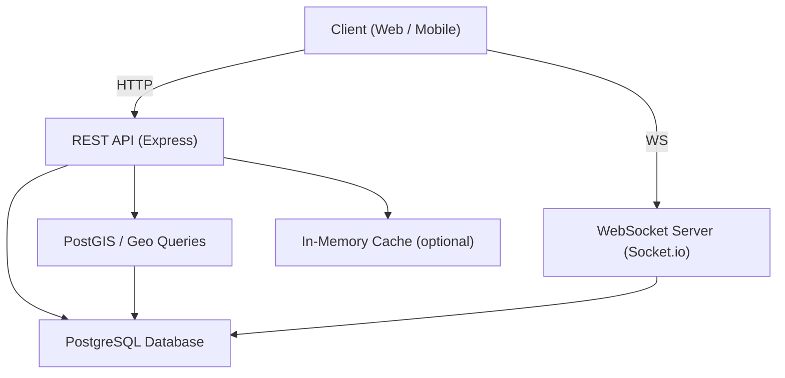
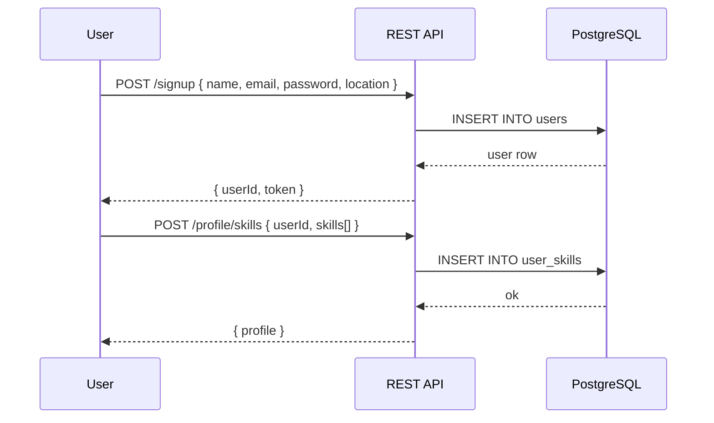
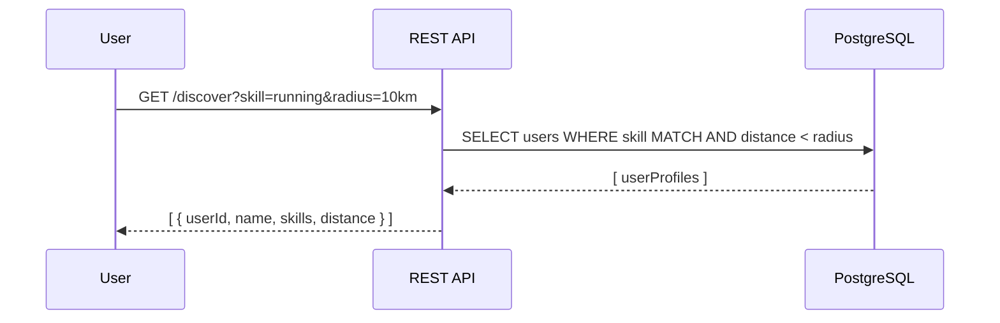
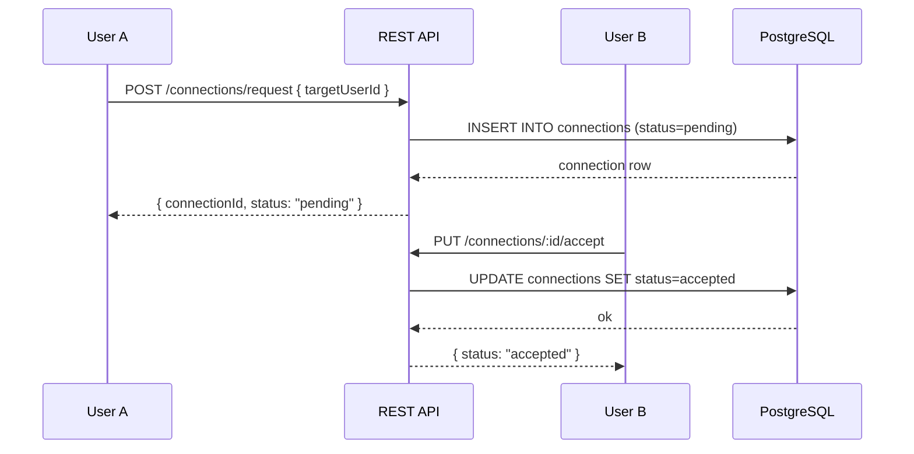
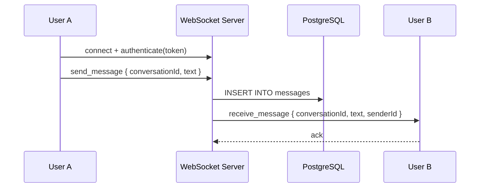

# Design Document: Skill Connect Platform

## Overview

Skill Connect is a location-aware social platform where people discover and connect with others who share the same personal life skills and hobbies — running, cycling, swimming, gym, and more. Think LinkedIn for real life: users build skill profiles, find nearby practitioners, send connection requests, and chat in real time or asynchronously.

The platform is built on the existing Express + PostgreSQL stack and extends it with skill profiles, location-based discovery, a connection graph, and a messaging layer.

---

## Architecture



---

## Sequence Diagrams

### User Registration & Profile Setup



### Location-Based Skill Discovery



### Connection Request Flow



### Real-Time Chat



---

## Components and Interfaces

### 1. Auth Service

**Purpose**: Register, login, and issue JWT tokens.

**Interface**:
```javascript
POST /signup   { name, email, password, location }  → { userId, token }
POST /login    { email, password }                  → { userId, token }
POST /logout   { token }                            → { ok }
```

**Responsibilities**:
- Hash passwords with bcrypt before storage
- Issue signed JWT on successful auth
- Validate token on protected routes via middleware

---

### 2. Profile Service

**Purpose**: Manage user profiles and skill associations.

**Interface**:
```javascript
GET  /profile/:userId                              → UserProfile
PUT  /profile/:userId  { bio, location, avatar }   → UserProfile
POST /profile/skills   { skills: SkillEntry[] }    → UserProfile
DELETE /profile/skills/:skillId                    → { ok }
```

**Responsibilities**:
- Store and update user bio, avatar, and location coordinates
- Associate users with one or more skill categories
- Return enriched profile including skill list and connection count

---

### 3. Discovery Service

**Purpose**: Find nearby users who share a given skill.

**Interface**:
```javascript
GET /discover?skill=running&lat=40.7&lng=-74.0&radius=10
→ [ { userId, name, skills, distanceKm, avatar } ]
```

**Responsibilities**:
- Accept skill filter and geo coordinates + radius
- Query users within radius using Haversine formula or PostGIS
- Return ranked results (closest first)

---

### 4. Connection Service

**Purpose**: Manage the social graph (follow/connect model).

**Interface**:
```javascript
POST /connections/request  { targetUserId }        → Connection
PUT  /connections/:id/accept                       → Connection
PUT  /connections/:id/decline                      → Connection
DELETE /connections/:id                            → { ok }
GET  /connections/:userId                          → Connection[]
```

**Responsibilities**:
- Enforce one pending request per pair
- Transition connection status: pending → accepted | declined
- Expose connection list for a given user

---

### 5. Messaging Service

**Purpose**: Real-time and async chat between connected users.

**Interface**:
```javascript
// REST
GET  /conversations/:userId                        → Conversation[]
GET  /conversations/:conversationId/messages       → Message[]
POST /conversations  { participantIds[] }          → Conversation

// WebSocket events
send_message    { conversationId, text }           → void
receive_message { conversationId, text, senderId, timestamp }
typing          { conversationId }                 → void
```

**Responsibilities**:
- Only allow messaging between accepted connections
- Persist all messages to DB
- Emit real-time events via Socket.io
- Support async delivery (store-and-forward when recipient is offline)

---

## Data Models

### users

```sql
CREATE TABLE users (
  id          UUID PRIMARY KEY DEFAULT gen_random_uuid(),
  name        VARCHAR(100) NOT NULL,
  email       VARCHAR(255) UNIQUE NOT NULL,
  password    VARCHAR(255) NOT NULL,  -- bcrypt hash
  bio         TEXT,
  avatar_url  VARCHAR(500),
  lat         DECIMAL(9,6),
  lng         DECIMAL(9,6),
  location    VARCHAR(255),
  created_at  TIMESTAMP DEFAULT NOW()
);
```

### skills

```sql
CREATE TABLE skills (
  id    SERIAL PRIMARY KEY,
  name  VARCHAR(100) UNIQUE NOT NULL  -- 'running', 'cycling', 'swimming', 'gym', etc.
);
```

### user_skills

```sql
CREATE TABLE user_skills (
  id         SERIAL PRIMARY KEY,
  user_id    UUID REFERENCES users(id) ON DELETE CASCADE,
  skill_id   INT  REFERENCES skills(id) ON DELETE CASCADE,
  level      VARCHAR(50),  -- 'beginner', 'intermediate', 'advanced'
  years_exp  INT,
  UNIQUE(user_id, skill_id)
);
```

### connections

```sql
CREATE TABLE connections (
  id           UUID PRIMARY KEY DEFAULT gen_random_uuid(),
  requester_id UUID REFERENCES users(id) ON DELETE CASCADE,
  addressee_id UUID REFERENCES users(id) ON DELETE CASCADE,
  status       VARCHAR(20) DEFAULT 'pending',  -- pending | accepted | declined
  created_at   TIMESTAMP DEFAULT NOW(),
  updated_at   TIMESTAMP DEFAULT NOW(),
  UNIQUE(requester_id, addressee_id)
);
```

### conversations

```sql
CREATE TABLE conversations (
  id         UUID PRIMARY KEY DEFAULT gen_random_uuid(),
  created_at TIMESTAMP DEFAULT NOW()
);

CREATE TABLE conversation_participants (
  conversation_id UUID REFERENCES conversations(id) ON DELETE CASCADE,
  user_id         UUID REFERENCES users(id) ON DELETE CASCADE,
  PRIMARY KEY (conversation_id, user_id)
);
```

### messages

```sql
CREATE TABLE messages (
  id              UUID PRIMARY KEY DEFAULT gen_random_uuid(),
  conversation_id UUID REFERENCES conversations(id) ON DELETE CASCADE,
  sender_id       UUID REFERENCES users(id) ON DELETE CASCADE,
  text            TEXT NOT NULL,
  sent_at         TIMESTAMP DEFAULT NOW(),
  read_at         TIMESTAMP
);
```

---

## Algorithmic Pseudocode

### Discovery Algorithm (Location + Skill Filter)

```pascal
ALGORITHM discoverUsers(requestingUserId, skillName, lat, lng, radiusKm)
INPUT:  requestingUserId (UUID), skillName (String), lat (Decimal),
        lng (Decimal), radiusKm (Number)
OUTPUT: results (Array of UserSummary), ordered by distance ascending

BEGIN
  ASSERT lat BETWEEN -90 AND 90
  ASSERT lng BETWEEN -180 AND 180
  ASSERT radiusKm > 0

  skill ← database.skills.findByName(skillName)
  IF skill IS NULL THEN
    RETURN Error("Unknown skill category")
  END IF

  candidates ← database.query(
    SELECT u.id, u.name, u.avatar_url, u.lat, u.lng
    FROM users u
    JOIN user_skills us ON us.user_id = u.id
    WHERE us.skill_id = skill.id
      AND u.id != requestingUserId
      AND u.lat IS NOT NULL
      AND u.lng IS NOT NULL
  )

  results ← []

  FOR each candidate IN candidates DO
    dist ← haversine(lat, lng, candidate.lat, candidate.lng)
    IF dist <= radiusKm THEN
      results.append({ ...candidate, distanceKm: dist })
    END IF
  END FOR

  SORT results BY distanceKm ASCENDING

  ASSERT ALL r IN results: r.distanceKm <= radiusKm

  RETURN results
END
```

**Preconditions:**
- `lat`, `lng` are valid geographic coordinates
- `radiusKm` is a positive number
- `requestingUserId` exists in the users table

**Postconditions:**
- All returned users share the requested skill
- All returned users are within `radiusKm` of the given coordinates
- Results are sorted by distance ascending
- The requesting user is never included in results

**Loop Invariant:**
- At each iteration, `results` contains only users within radius processed so far

---

### Haversine Distance Function

```pascal
FUNCTION haversine(lat1, lng1, lat2, lng2)
INPUT:  lat1, lng1, lat2, lng2 (Decimal degrees)
OUTPUT: distance (Number, kilometers)

BEGIN
  R ← 6371  // Earth radius in km

  dLat ← toRadians(lat2 - lat1)
  dLng ← toRadians(lng2 - lng1)

  a ← sin(dLat/2)^2
        + cos(toRadians(lat1)) * cos(toRadians(lat2)) * sin(dLng/2)^2

  c ← 2 * atan2(sqrt(a), sqrt(1 - a))

  RETURN R * c
END
```

---

### Connection Request Algorithm

```pascal
ALGORITHM sendConnectionRequest(requesterId, addresseeId)
INPUT:  requesterId (UUID), addresseeId (UUID)
OUTPUT: Connection | Error

BEGIN
  ASSERT requesterId != addresseeId

  existing ← database.connections.findByPair(requesterId, addresseeId)

  IF existing IS NOT NULL THEN
    IF existing.status = 'pending' THEN
      RETURN Error("Request already pending")
    END IF
    IF existing.status = 'accepted' THEN
      RETURN Error("Already connected")
    END IF
  END IF

  connection ← database.connections.insert({
    requesterId,
    addresseeId,
    status: 'pending'
  })

  ASSERT connection.status = 'pending'

  RETURN connection
END
```

**Preconditions:**
- `requesterId` and `addresseeId` are different valid user IDs
- No accepted connection already exists between the pair

**Postconditions:**
- A new connection row with `status = 'pending'` is created
- Or an appropriate error is returned if a duplicate/conflict exists

---

### Message Send Algorithm

```pascal
ALGORITHM sendMessage(senderId, conversationId, text)
INPUT:  senderId (UUID), conversationId (UUID), text (String)
OUTPUT: Message | Error

BEGIN
  ASSERT text IS NOT NULL AND text.length > 0

  isParticipant ← database.conversation_participants
                    .exists(conversationId, senderId)

  IF NOT isParticipant THEN
    RETURN Error("Not a participant in this conversation")
  END IF

  message ← database.messages.insert({
    conversationId,
    senderId,
    text,
    sentAt: NOW()
  })

  recipients ← database.conversation_participants
                  .findAll(conversationId)
                  .filter(p => p.userId != senderId)

  FOR each recipient IN recipients DO
    IF socketServer.isConnected(recipient.userId) THEN
      socketServer.emit(recipient.userId, 'receive_message', message)
    END IF
  END FOR

  ASSERT message.id IS NOT NULL
  ASSERT message.sentAt IS NOT NULL

  RETURN message
END
```

**Preconditions:**
- `senderId` is a participant in `conversationId`
- `text` is a non-empty string

**Postconditions:**
- Message is persisted to the database
- Online recipients receive the message via WebSocket
- Offline recipients will receive it on next fetch

---

## Key Functions with Formal Specifications

### `discoverUsers(requestingUserId, skillName, lat, lng, radiusKm)`

**Preconditions:**
- `lat ∈ [-90, 90]`, `lng ∈ [-180, 180]`
- `radiusKm > 0`
- `skillName` is a known skill category

**Postconditions:**
- Returns array of users sorted by distance ascending
- Every result satisfies `haversine(lat, lng, r.lat, r.lng) ≤ radiusKm`
- `requestingUserId` is excluded from results

---

### `sendConnectionRequest(requesterId, addresseeId)`

**Preconditions:**
- `requesterId ≠ addresseeId`
- No existing `accepted` connection between the pair

**Postconditions:**
- New connection with `status = 'pending'` created, OR
- Error returned if duplicate/conflict detected

---

### `sendMessage(senderId, conversationId, text)`

**Preconditions:**
- `senderId` is a participant in `conversationId`
- `text.length > 0`

**Postconditions:**
- Message persisted with `sentAt` timestamp
- Online recipients notified via WebSocket

---

## Error Handling

### Auth Errors
- Invalid credentials → `401 Unauthorized`
- Missing/expired token → `401 Unauthorized`
- Accessing another user's private data → `403 Forbidden`

### Discovery Errors
- Unknown skill name → `400 Bad Request { error: "Unknown skill category" }`
- Invalid coordinates → `400 Bad Request { error: "Invalid coordinates" }`
- No results found → `200 OK []` (empty array, not an error)

### Connection Errors
- Self-connection attempt → `400 Bad Request`
- Duplicate pending request → `409 Conflict`
- Already connected → `409 Conflict`

### Messaging Errors
- Non-participant sending message → `403 Forbidden`
- Empty message text → `400 Bad Request`
- Conversation not found → `404 Not Found`

---

## Testing Strategy

### Unit Testing

- `haversine()` — verify known coordinate pairs produce correct distances
- `validateSkill()` — test all valid and invalid skill names
- `hashPassword()` / `verifyPassword()` — bcrypt round-trip
- Connection state machine transitions (pending → accepted/declined)

### Property-Based Testing

**Library**: fast-check

- For any two coordinate pairs within radius R, `discoverUsers` must include both users
- For any two coordinate pairs beyond radius R, neither should appear in results
- `haversine(a, b) === haversine(b, a)` (symmetry)
- `haversine(a, a) === 0` (identity)
- Sending a connection request twice always returns a conflict on the second call

### Integration Testing

- Full signup → add skills → discover → connect → chat flow
- Verify WebSocket message delivery between two connected sessions
- Verify non-connected users cannot message each other

---

## Performance Considerations

- Add a composite index on `user_skills(skill_id)` and `users(lat, lng)` for fast geo queries
- For scale, replace Haversine JS loop with a PostGIS `ST_DWithin` query
- Paginate `/discover` results (default page size: 20)
- Cache skill list (rarely changes) in memory or Redis
- Use connection pooling (already using `pg` pool)

---

## Security Considerations

- Passwords stored as bcrypt hashes (never plaintext)
- All protected routes require valid JWT in `Authorization: Bearer <token>` header
- Users can only read/write their own profile data
- Messaging restricted to accepted connections only
- Rate-limit `/signup`, `/login`, and `/connections/request` endpoints
- Sanitize all text inputs to prevent SQL injection (use parameterized queries — already in place)

---

## Dependencies

| Package | Purpose |
|---|---|
| `express` | HTTP server (existing) |
| `pg` | PostgreSQL client (existing) |
| `cors` | CORS middleware (existing) |
| `dotenv` | Environment config (existing) |
| `bcrypt` | Password hashing |
| `jsonwebtoken` | JWT auth tokens |
| `socket.io` | Real-time WebSocket messaging |
| `uuid` | UUID generation |

---

## Correctness Properties

*A property is a characteristic or behavior that should hold true across all valid executions of a system — essentially, a formal statement about what the system should do. Properties serve as the bridge between human-readable specifications and machine-verifiable correctness guarantees.*

### Property 1: Registration round-trip

*For any* valid user registration payload (name, email, password, location), submitting it to the Auth_Service should produce a response containing a non-null userId and a non-empty JWT token.

**Validates: Requirements 1.1**

---

### Property 2: Password never stored as plaintext

*For any* password submitted during registration, the value stored in the database for that user should not equal the original plaintext password.

**Validates: Requirements 1.3, 10.1**

---

### Property 3: Login round-trip

*For any* user registered with valid credentials, submitting those same credentials to the login endpoint should return a valid JWT token and the correct userId.

**Validates: Requirements 2.1**

---

### Property 4: Invalid credentials are rejected

*For any* email/password pair where the password does not match the stored hash for that email, the Auth_Service should return a 401 Unauthorized response.

**Validates: Requirements 2.2**

---

### Property 5: Protected routes require valid JWT

*For any* protected endpoint, a request made without a valid JWT in the Authorization header should receive a 401 Unauthorized response.

**Validates: Requirements 2.3, 10.2**

---

### Property 6: Cross-user data access is forbidden

*For any* two distinct users A and B, user A attempting to access or modify user B's private profile data should receive a 403 Forbidden response.

**Validates: Requirements 2.4, 10.5**

---

### Property 7: Profile response contains all required fields

*For any* user who has skills and connections, fetching their own profile should return a response that includes bio, avatar URL, location, a non-empty skill list, and a connection count.

**Validates: Requirements 3.1**

---

### Property 8: Profile update round-trip

*For any* valid profile update payload (bio, location, or avatar), submitting the update and then fetching the profile should return a profile that reflects the updated values.

**Validates: Requirements 3.2**

---

### Property 9: Skill addition round-trip

*For any* valid skill name, adding it to a user's profile and then fetching that profile should result in the skill appearing in the user's skill list.

**Validates: Requirements 4.1**

---

### Property 10: Duplicate skill addition is rejected

*For any* skill already associated with a user's profile, attempting to add the same skill again should return a 409 Conflict response, and the profile's skill list should remain unchanged.

**Validates: Requirements 4.2, 4.5**

---

### Property 11: Skill deletion round-trip

*For any* skill associated with a user's profile, deleting it and then fetching the profile should result in that skill no longer appearing in the user's skill list.

**Validates: Requirements 4.3**

---

### Property 12: Discovery correctness — skill, radius, and sort

*For any* valid discovery query (skill, lat, lng, radiusKm), every user in the returned results must (a) have the requested skill, (b) have a computed Haversine distance ≤ radiusKm from the query coordinates, and (c) the results must be ordered by distance ascending.

**Validates: Requirements 5.1, 5.4**

---

### Property 13: Haversine symmetry and identity

*For any* two valid geographic coordinates A and B: `haversine(A, B) === haversine(B, A)` (symmetry), and `haversine(A, A) === 0` (identity).

**Validates: Requirements 5.2**

---

### Property 14: Requesting user excluded from discovery

*For any* discovery query, the userId of the requesting user should never appear in the returned results.

**Validates: Requirements 5.3**

---

### Property 15: Connection request creates pending record

*For any* two distinct users A and B with no existing connection, user A sending a connection request to user B should result in a connection record with status `pending` being created and returned.

**Validates: Requirements 6.1**

---

### Property 16: Duplicate connection requests are rejected

*For any* pair of users that already have a `pending` or `accepted` connection, attempting to send another connection request between them should return a 409 Conflict response.

**Validates: Requirements 6.3, 6.4, 6.5**

---

### Property 17: Connection accept state transition

*For any* pending connection, the addressee accepting it should result in the connection status transitioning to `accepted`.

**Validates: Requirements 7.1**

---

### Property 18: Connection decline state transition

*For any* pending connection, the addressee declining it should result in the connection status transitioning to `declined`.

**Validates: Requirements 7.2**

---

### Property 19: Connection list round-trip

*For any* user, all connections created involving that user should appear in the response when fetching that user's connection list.

**Validates: Requirements 7.3**

---

### Property 20: Connection deletion round-trip

*For any* existing connection, deleting it and then fetching the connection list should result in that connection no longer appearing in the list.

**Validates: Requirements 7.5**

---

### Property 21: Conversation creation associates all participants

*For any* set of mutually connected users, creating a conversation with those participant IDs should result in a Conversation object where all specified users are listed as participants.

**Validates: Requirements 8.1**

---

### Property 22: Conversation list round-trip

*For any* user who is a participant in a conversation, fetching that user's conversation list should include the conversation.

**Validates: Requirements 8.2**

---

### Property 23: Message history round-trip

*For any* sequence of messages sent in a conversation, fetching the message history for that conversation should return all sent messages with their correct text, senderId, and non-null sentAt timestamp.

**Validates: Requirements 8.3, 9.2, 11.3**

---

### Property 24: WebSocket authentication establishes session

*For any* valid JWT token, connecting to the WebSocket_Server with that token should result in an authenticated session being established for the corresponding user.

**Validates: Requirements 9.1**

---

### Property 25: Real-time message delivery to online recipients

*For any* message sent in a conversation, all online participants of that conversation except the sender should receive a `receive_message` WebSocket event containing the correct conversationId, text, senderId, and timestamp.

**Validates: Requirements 9.3**

---

### Property 26: Typing indicator broadcast

*For any* typing event sent by a participant in a conversation, all other online participants of that conversation should receive the typing indicator broadcast.

**Validates: Requirements 9.5**

---

### Property 27: Cascade delete removes all associated records

*For any* user account that is deleted, there should be no remaining records in user_skills, connections, conversation_participants, or messages tables that reference that user's ID.

**Validates: Requirements 11.1**

---

### Property 28: UUID uniqueness across records

*For any* two records of the same entity type (users, connections, conversations, or messages) created independently, their primary key UUIDs should be distinct.

**Validates: Requirements 11.4**
